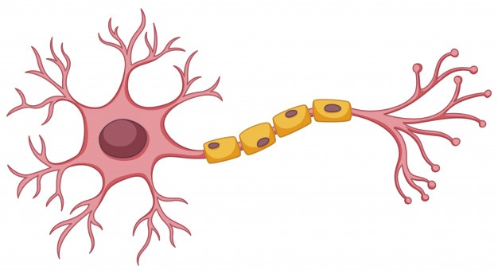
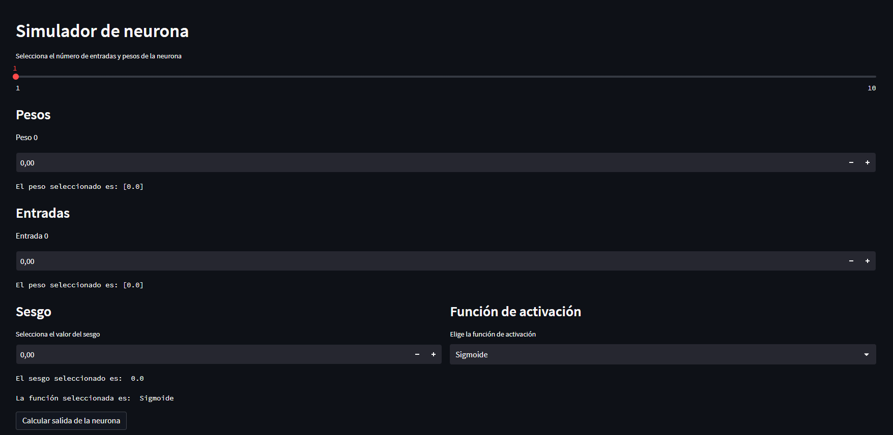

# [Simulador Neurona 🧠](https://jaimesalado-simuladorneurona-app-ouy6aw.streamlit.app/ "Simulador Neurona 🧠")

Web streamlit con python. Donde podemos calcular el valor de salida de una neurona según entradas, pesos, sesgo y función de activación que le introducimos.

